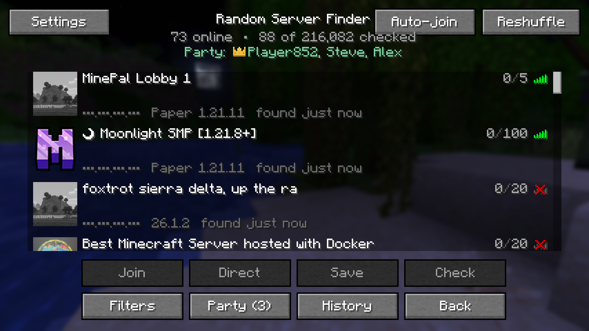
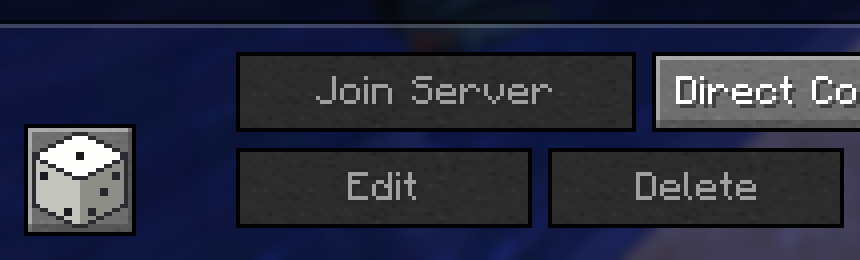
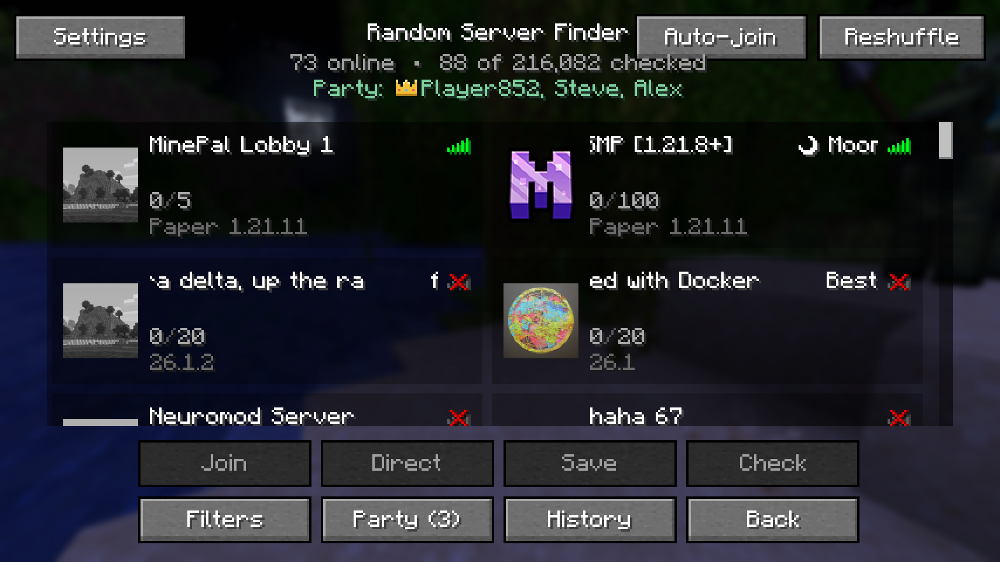
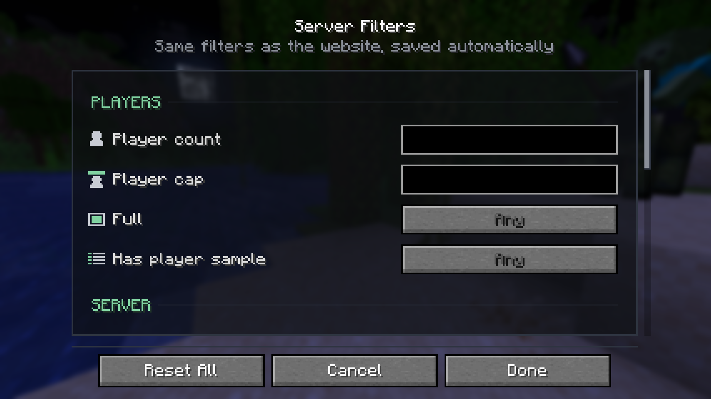
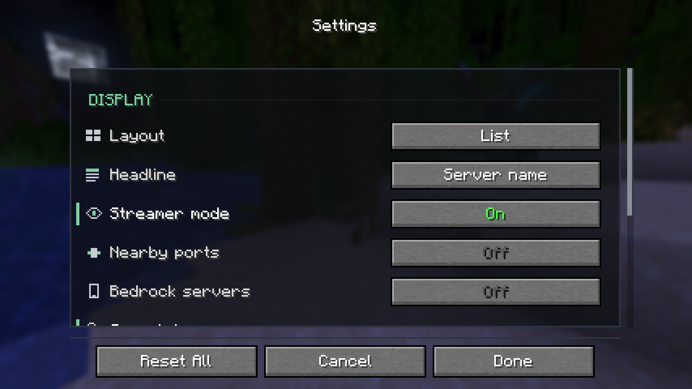
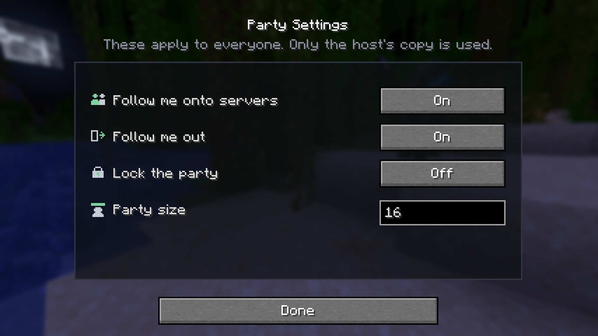
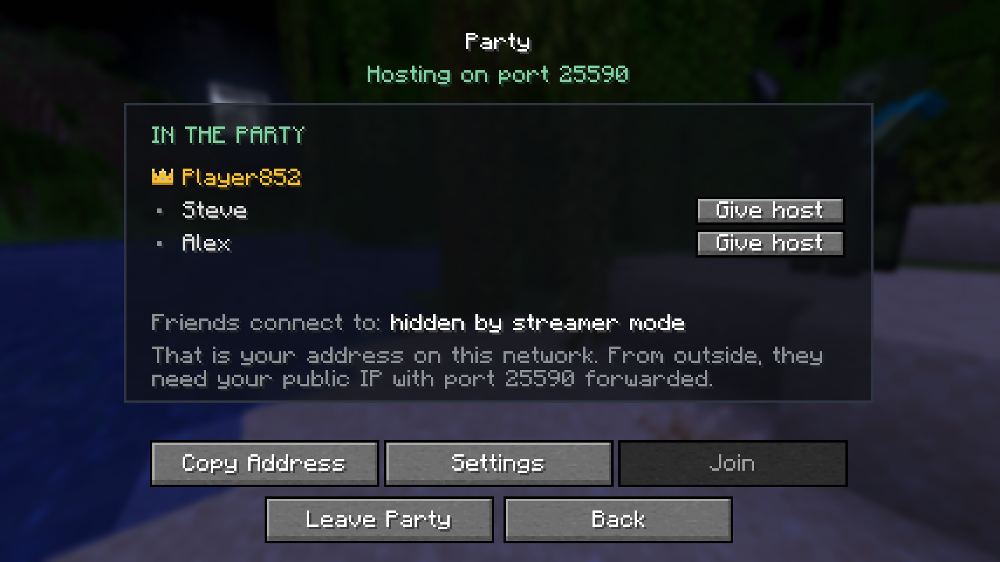

<div align="center">

<picture>
  <source media="(prefers-color-scheme: dark)" srcset="src/main/resources/assets/randomserverfinder/icon.png">
  
</picture>

# Random Server Finder

**A dice button in your multiplayer menu that drops you onto a random Minecraft server.**

No API, no account, no website. It pings everything itself, so every server it shows is online right now.
Drop one jar in your mods folder, click the dice, done.

[](https://github.com/miiazertyy/RandomServerFinder/actions/workflows/build.yml)
[](https://github.com/miiazertyy/RandomServerFinder/releases/latest)
[](https://github.com/miiazertyy/RandomServerFinder/releases)
[](LICENSE)




</div>

---

> [!IMPORTANT]
> **Use it with [ViaFabricPlus](https://modrinth.com/mod/viafabricplus).** Random servers run every Minecraft version ever released, and vanilla refuses to connect to any but your own, so without it most results show a red ✗ and cannot be joined. ViaFabricPlus translates as you connect, so you can walk into a 1.8, 1.16 or 26.2 server without changing your client. Client side only, nothing needed on the servers.

> [!TIP]
> Need help, or want a feature? [Open an issue](https://github.com/miiazertyy/RandomServerFinder/issues/new). There are no dumb questions.

---

## What makes it good

Anyone can shuffle a list of IPs. The work here is in making every result worth clicking.

| | |
|---|---|
| **Only live servers** | Every entry was pinged a moment ago. Real icon, MOTD, player count, player list and latency |
| **Never runs out** | Scroll and it keeps finding more, with no repeats |
| **Scrolls like butter** | Eases with real elapsed time, so it feels the same at 60 fps and 240. Vanilla snaps a whole step per notch; this glides |
| **Filters that stick** | Players, version, MOTD, icon, port, subnet and more, remembered between sessions and shown as chips under the title |
| **Checks before you knock** | Asks a server whether it wants a paid account, or would bounce you with a whitelist or ban, before you waste a connection |
| **Auto-join** | Keeps trying random servers until one lets you in, and carries on hopping when you leave |
| **Parties** | Friends follow whoever wears the crown from server to server, automatically |
| **Remembers your finds** | A green ✔ marks servers you have joined, and History gets you back to one. A random result is gone once you scroll past it |
| **Safe on stream** | Streamer mode hides every address on screen. A random server is usually somebody's home machine |
| **Ready before you are** | Searches quietly while you sit on the title screen, and stops completely once you are in a world |

<details>
<summary><b>And the rest of it</b></summary>

<br>

- List layout for scanning quickly, or cards that give every server icon room to be recognised
- Headline each server by its MOTD name or by its address
- Double click to join, **Direct** to open Direct Connect with the address filled in, **Save** to add it to your server list
- **Reshuffle** throws the current results away and starts over
- An auto-join queue you can reorder by dragging, or trim with a click
- Auto-join can accept server resource packs for you, and waits as long as you tell it between tries
- Optional Bedrock servers, and optional probing of ports next to 25565
- Extra address lists of your own on top of the bundled one
- Hide servers you have already joined, or ones that stopped answering
- Seven languages: English, Deutsch, Español, Français, 日本語, Русский, 中文

</details>

---

## Get it running

**1. Install Fabric**

[Fabric Loader](https://fabricmc.net/use/installer) **0.19.3 or newer** (0.19.5 for 26.3), and [Fabric API](https://modrinth.com/mod/fabric-api).

**2. Download**

From the [latest release](https://github.com/miiazertyy/RandomServerFinder/releases/latest), take the jar
for the Minecraft version you play. Each one only loads on its own version.

| You play | Take the jar ending in |
|---|---|
| 26.3 | `-mc26.3.jar` |
| 26.2 | `-mc26.2.jar` |
| 26.1.2 | `-mc26.1.2.jar` |
| 1.21.11 | `-mc1.21.11.jar` |
| 1.21.1 | `-mc1.21.1.jar` |
| 1.20.6 | `-mc1.20.6.jar` |
| 1.20.1 | `-mc1.20.1.jar` |

**3. Drop it in**

Put it in your `mods` folder along with Fabric API and [ViaFabricPlus](https://modrinth.com/mod/viafabricplus).
On Windows that is `%APPDATA%\.minecraft\mods`.

**4. Roll the dice**



Open **Multiplayer**. The dice sits in the bottom left corner. That is the whole setup.

<br clear="right">

---

## The screens

<table>
<tr>
<td width="50%"></td>
<td width="50%"></td>
</tr>
<tr>
<td><b>Cards</b><br>The same results as tiles, with room for each server's icon and more of its description.</td>
<td><b>Filters</b><br>What a server has to be before it is shown. Remembered between sessions.</td>
</tr>
<tr>
<td></td>
<td></td>
</tr>
<tr>
<td><b>Settings</b><br>Layout, streamer mode, auto-join and how the search behaves. Nothing here changes which servers are found.</td>
<td><b>Party settings</b><br>Whether friends follow you in and out, how many can join, and whether the party is locked.</td>
</tr>
</table>

| Button | What it does |
|---|---|
| **Join** | Connects. Double clicking a row does the same |
| **Direct** | Opens Direct Connect with the address filled in |
| **Save** | Adds the server to your normal multiplayer list |
| **Check** | Asks whether it needs a paid account, or would turn you away |
| **Filters** | What to require, what to hide, how it looks |
| **Party** | Hop between servers together with friends |
| **History** | Servers you have joined from here |
| **Auto-join** | Keep trying servers until one lets you in |
| **Reshuffle** | Throw these results away and start finding again |

### Parties



One person hosts, the others join their address, and from then on the party goes wherever the
person with the **gold crown** goes. They join a server, everyone follows. They leave, everyone
comes back to the finder.

The crown starts with the host and can be handed to anyone: press **Give host** next to their name.
Only whoever wears it can pass it on, and if they drop out it goes back to the host.

The host's game still carries the connection for everyone after handing the crown over, so if the
host leaves, the party ends.

**Settings** decides whether people follow you onto servers, follow you out, how many can join,
and whether the party is locked.

<br clear="right">

> [!NOTE]
> Friends connect to your address, not your username. Matching a name to a machine would need a server that tracks who is online, and this mod does not run one. On the same network your local address works as is. From outside, they need your public IP with the party port (25577 by default) forwarded, the same as hosting any server.

---

## Filters

Address filters are applied before anything is pinged, so narrowing by port or subnet costs nothing.

| Filter | Takes | Example |
|---|---|---|
| Player count, player cap | A number or a range | `3`, `>1`, `<=5`, `1-10` |
| Version, host | A pattern, `%` matches anything | `%1.21%`, `Paper%` |
| IP / subnet | A list, `!` excludes | `1.0.0.0/8, !2.3.4.0/24` |

> [!NOTE]
> Some servers can never show up. Anything behind a proxy that routes by hostname (Aternos, Minehut, Falix, anything on Cloudflare) cannot be reached by IP, so no scan can find it.

---

## Where your data lives

Everything sits in your Minecraft `config` folder, and updating the mod never touches it.

| | |
|---|---|
| `randomserverfinder.json` | every setting and filter |
| `randomserverfinder-joined.json` | your join history |
| `randomserverfinder-ips*.bin` | cached address lists |

Delete a file to reset that part of it.

---

## From source

You need none of this to use the mod.

```shell
git clone https://github.com/miiazertyy/RandomServerFinder
cd RandomServerFinder
./gradlew build          # .\gradlew.bat build on Windows
```

Needs a **JDK 21 or newer** and nothing else. The Gradle wrapper fetches Gradle, Minecraft and a
Java 21 toolchain itself. The first build decompiles Minecraft, so expect a few minutes. The jar
lands in `build/libs/` (ignore the `-sources` one). `./gradlew runClient` starts a test game with the
mod loaded.

<details>
<summary><b>How it is laid out</b></summary>

<br>

```text
src/shared/java     no Minecraft at all, compiled once for every version
  api/              the server record
  config/           settings, join history, streamer mode
  filter/           filters, chips and their pictograms
  local/            the address list, pinging, the login probe, Bedrock
  party/            what the party needs without touching the game
src/mc26/java       the UI for 26.x, unobfuscated, Mojang names
src/mc121/java      the UI for 1.21.9 and later
src/mc120/java      the UI for 1.20.2 through 1.21.8
src/mc1201/java     the UI for 1.20.1
src/main/resources  the mod icon, the bundled address list, translations
build-all.ps1       builds every supported version into dist/
```

Roughly half the mod, the address list, filtering, the login probe, config and join history, is in
`shared` and built identically for all of them. `build.gradle` picks the right tree from the
Minecraft version alone.

</details>

<details>
<summary><b>Why four copies of the UI</b></summary>

<br>

Minecraft 26.1 stopped being obfuscated, which split the toolchain in two. 26.x uses the
non-remapping `net.fabricmc.fabric-loom` plugin with no mappings; 1.21.x and 1.20.x use
`net.fabricmc.fabric-loom-remap` with Yarn. On top of that, 26.x renamed nearly every class in the
game and replaced `render(DrawContext…)` with `extractRenderState(GuiGraphicsExtractor…)`, 1.21.9
changed how mouse clicks arrive, and 1.20.1 predates `ServerInfo.Status`, `drawGuiTexture`, the
four-argument `mouseScrolled` and the multiplayer screen packages.

Those differences are method overrides and enum constants, so their shapes have to match at compile
time. No amount of reflection bridges them, which is why the trees exist at all, rather than one
tree full of conditionals.

</details>

<details>
<summary><b>Building every version</b></summary>

<br>

```shell
powershell -ExecutionPolicy Bypass -File .\build-all.ps1
```

Builds the mod against every supported Minecraft version and collects the jars in `dist/`, named
ready to upload. Pass versions to build only those:

```shell
.\build-all.ps1 1.21.11 26.3
```

The versions, and the Yarn, Fabric API and Loader each one builds against, live in
`versions.json`. Adding a line there adds that version to this script and to GitHub at once.

A version that fails is reported rather than skipped silently, and `gradle.properties` is put back
afterwards either way.

</details>

<details>
<summary><b>GitHub Actions and releases</b></summary>

<br>

`.github/workflows/build.yml` builds every version in `versions.json` side by side on each push
and pull request, and keeps the jars as downloadable artifacts on the run.

To release, publish a release on GitHub with a tag like `1.0.2` or `v1.0.2`. The same builds run
against the tagged commit, and a few minutes later the jars are attached to the release. They are
built as the version the tag names, so `mod_version` in `gradle.properties` only names local builds.
A draft is built once it is published. Each jar is also published to Modrinth as its own version,
which needs a `MODRINTH_TOKEN` repository secret and the project's ID in the workflow.

For a release that is already out without its jars, open **Actions → Build → Run workflow** and
give it the release's tag.

</details>

---

<div align="center">

Made for everyone who has scrolled their own server list and wished there was more out there.

</div>
